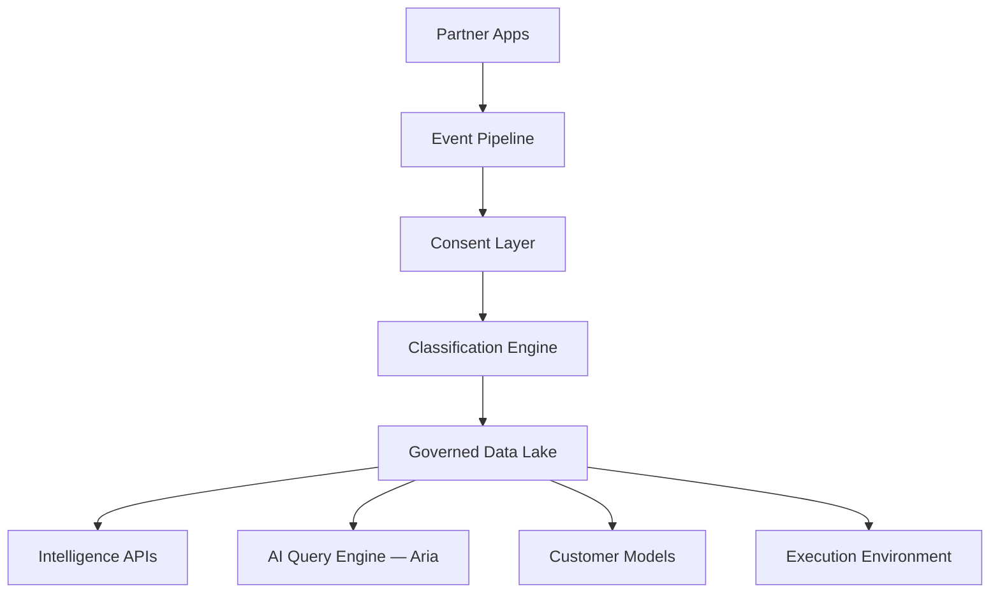

# Full architecture

> Live visual board: [`/docs/architecture`](/docs/architecture)

## Platform spine

## Layers

| # | Layer | Purpose |
| --- | --- | --- |
| 01 | Platform spine | Partner signal → governed lake |
| 02 | Consumption surfaces | APIs · Aria · Customer models · Execution |
| 03 | Commercial depth | Credits → run-on-infra |
| 04 | Aria runtime | What is live today in the AI Query Engine |
| 05 | Request path | Composer → stream |
| 06 | Governance | Consent · k-floor · audit ≡ metering |
| 07 | Build order | P0 → P1 → P2 |

## Principle

Aria consumes governed intelligence. It is not the data plane. Raw behavioural signal never reaches the chat boundary; on the deepest surface it never egresses at all.
