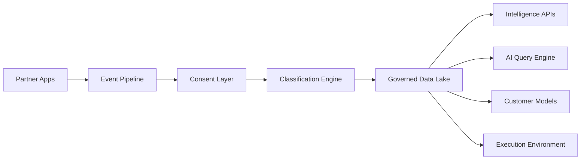

# Architecture overview

## Platform data path

Aria is one consumer of the Governed Data Lake — the **AI Query Engine** — not the data plane itself.



## Aria application stack (today)

| Layer | Choice |
| --- | --- |
| Framework | Next.js 16 (App Router, Turbopack) |
| UI | React 19, Tailwind CSS 4, Base UI, shadcn |
| Chat runtime | `@assistant-ui/react` + Vercel AI SDK |
| Models | `@ai-sdk/google` (primary), `@ai-sdk/openai` (optional) |
| Client state | Zustand (persisted preferences) |
| Thread list | `localStorage` via remote thread-list adapter |
| Export | jsPDF, docx, pptxgenjs, SheetJS |

## Target tech stack

Full platform stack (Aria + BNII). Details: [Tech stack](/architecture/tech-stack).

| Layer | Technology | Purpose |
| --- | --- | --- |
| Frontend | Next.js | Chat UI & Dashboard |
| UI Framework | Tailwind CSS + Shadcn UI | Modern User Experience |
| Authentication | Firebase Authentication | User Login & Identity Management |
| Backend | Next.js API Routes | API Gateway |
| AI Model | Gemini 2.5 Flash | Chat & Intelligence Generation |
| Web Search | Tavily API | Real-Time Search |
| Deep Research | Tavily + Firecrawl | Multi-step Research |
| Payment Gateway | Stripe | Credit Purchases, Subscriptions, Billing |
| Database | Google Cloud SQL (PostgreSQL) | Users, Chats, Audit Logs, Metadata |
| Cache | Redis (Memorystore / Upstash) | Response & Session Cache |
| File Storage | Google Cloud Storage | Documents & Uploads |
| Vector Search | pgvector / Vertex AI Vector Search | Semantic Search & RAG |
| Event Pipeline | Google Pub/Sub | Event Streaming |
| Data Warehouse | BigQuery | Intelligence & Analytics |
| Monitoring | Cloud Monitoring + Sentry | Logs & Error Tracking |
| Deployment | Cloud Run | Backend Services |
| CI/CD | GitHub Actions + Cloud Build | Automated Deployment |

## Design principles

1. **One write path for answers.** All model I/O goes through `POST /api/chat`. No parallel ad-hoc model calls from the client.
2. **Search before memory when Search is on.** If live research fails, the API returns 503 — it does not silently fall back to parametric memory.
3. **Deep Research is a contract, not a vibe.** Fixed section headings; client parses into an institutional brief UI.
4. **Secrets stay server-side.** API keys never enter the browser bundle.
5. **Auditability first.** Every future commercial surface (credits, APIs, BYOD) must reuse one metering/audit ledger — do not invent a second billing path.

## Repository map

```
ARIA/
├── app/
│   ├── api/chat/route.ts     # Sole streaming + research API
│   ├── assistant.tsx         # Runtime, transport, URL sync
│   ├── docs/                 # This documentation surface
│   ├── profile/              # Profile UI
│   └── page.tsx
├── components/
│   ├── aria/                 # Product shell, toggles, brief, share
│   ├── assistant-ui/         # Thread, markdown, tools, reasoning
│   └── ui/                   # Shared primitives
├── lib/
│   ├── models.ts
│   ├── aria-system-prompt.ts
│   ├── web-search.ts
│   ├── independent-web-search.ts
│   ├── query-normalize.ts
│   ├── parse-research-brief.ts
│   ├── aria-store.ts
│   ├── thread-storage.ts
│   └── export-chat.ts
└── docs/                     # Mintlify-compatible source MDX
```
