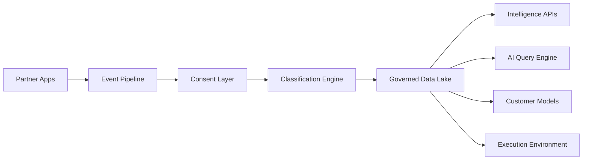

# System map

## Platform data path

Canonical BNII flow. Aria implements the **AI Query Engine** box today; the spine and other surfaces are platform roadmap.



| Node | Role |
| --- | --- |
| Partner Apps | Source of consented behavioural signal |
| Event Pipeline | Ingest + dual-write boundary |
| Consent Layer | Gate every downstream use |
| Classification Engine | Labels, segments, quality evals |
| Governed Data Lake | k-floor aggregates; single source of truth |
| Intelligence APIs | Structured pull for partner pipelines |
| AI Query Engine | **Aria** — briefs, credits, metered Q&A |
| Customer Models | Build-on-top / BYOD substrate |
| Execution Environment | Run-on-infra; model comes to data |

## Aria runtime (AI Query Engine)

```
┌─────────────────────────────────────────────────────────────┐
│                         Browser                              │
│  AppShell ─ Sidebar ─ TopBar ─ Thread ─ Composer toggles    │
│       │                                                      │
│       ├─ Zustand (model, deepResearch, webSearch, profile)  │
│       └─ localStorage threads (Recents + ?chat= sync)       │
└───────────────────────────┬─────────────────────────────────┘
                            │ POST /api/chat
                            ▼
┌─────────────────────────────────────────────────────────────┐
│                      Next.js server                          │
│  ┌──────────────┐   ┌────────────────────┐   ┌───────────┐ │
│  │ Model router │──▶│ Independent web    │──▶│ streamText│ │
│  │ Nano/Mini/Max│   │ research pipeline  │   │ → UI msg  │ │
│  └──────────────┘   └────────────────────┘   └───────────┘ │
│         │                     │                              │
│         ▼                     ▼                              │
│   Gemini / OpenAI      DDG / Bing + page fetch               │
└─────────────────────────────────────────────────────────────┘
```

## Still to build on the spine

- Event pipeline + dual-write
- Consent enforcement at release
- Classification-quality evals
- Governed data lake
- Intelligence APIs
- Customer-model substrate
- Tenant-isolated execution environment

Do not bolt these onto Aria as one-off client hacks.
